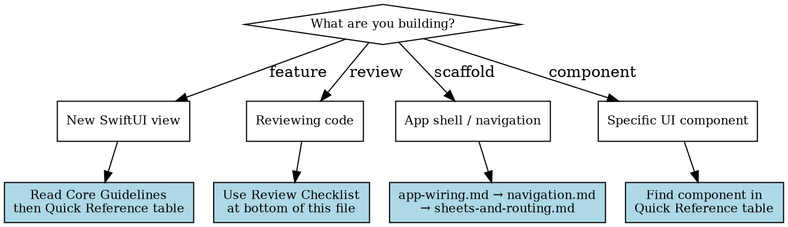

# SwiftUI UI Patterns

## Lifecycle Position

Phase 3 (Implement — best practices, UI architecture) and Phase 5 (Review — checklist). Core guidelines apply during implementation; review checklist during code review.

## When to Use

## Quick Reference — Which Reference to Load

| UI Need | Reference File |
|---------|---------------|
| App root shell, TabRouter, dependency graph | `references/app-wiring.md` |
| Tab architecture, AppTab enum, TabSection | `references/tabview.md` |
| NavigationStack routing, RouterPath | `references/navigation.md` |
| Sheet presentation, SheetDestination enum | `references/sheets-and-routing.md` |
| Lists, ForEach identity, scroll-to-top | `references/lists.md` |
| ScrollView, chat anchor, horizontal chips | `references/scroll-patterns.md` |
| LazyVGrid, adaptive/fixed columns | `references/grids.md` |
| Forms, themed modals, auto-focus | `references/forms-and-input.md` |
| .searchable, async debounced search | `references/searchable.md` |
| Toast overlay, auto-dismiss banners | `references/overlay-toast.md` |
| Bottom composer bar, .safeAreaInset | `references/input-toolbar.md` |
| iOS 26+ safeAreaBar, top bar | `references/top-bar.md` |
| @Observable Theme, semantic colors | `references/theming.md` |
| AsyncImage, QuickLook media viewer | `references/image-and-media.md` |
| Haptic feedback, HapticManager | `references/haptics.md` |
| Animations, matchedGeometryEffect, iOS 26+ zoom | `references/animation-transitions.md` |
| Deep links, URL dispatch, OpenURLAction | `references/deeplinks.md` |
| ToolbarTitleMenu, principal title | `references/title-menus.md` |
| NavigationSplitView vs manual split | `references/split-views.md` |
| .redacted placeholders, ContentUnavailableView | `references/loading-placeholders.md` |
| Closure-based client struct, store DI | `references/lightweight-clients.md` |
| Modern API replacements, deprecations | `references/modern-apis.md` |
| Property wrappers, @Observable, data flow | `references/state-management.md` |
| View extraction, composition rules | `references/view-structure.md` |
| Performance optimization, body purity | `references/performance-patterns.md` |
| Layout patterns, context-agnostic views | `references/layout-best-practices.md` |
| Text formatting, localizedStandardContains | `references/text-formatting.md` |
| Animation basics, implicit/explicit, timing | `references/animation-basics.md` |
| Advanced animation, phase/keyframe (iOS 17+) | `references/animation-advanced.md` |

## Core Guidelines

### State Management
- **Always prefer `@Observable` over `ObservableObject`** for new code
- **Mark `@Observable` classes with `@MainActor`** unless using default actor isolation
- **Always mark `@State` and `@StateObject` as `private`** (makes dependencies clear)
- **Never declare passed values as `@State` or `@StateObject`**
- `@State` for internal view state, or owned `@Observable` class
- `@Binding` only when child needs to **modify** parent state
- `@Bindable` for injected `@Observable` objects needing bindings
- Use `let` for read-only values; `var` + `.onChange()` for reactive reads
- Nested `ObservableObject` doesn't work — pass nested objects directly; `@Observable` handles nesting

### Modern APIs
- `foregroundStyle()` not `foregroundColor()`
- `clipShape(.rect(cornerRadius:))` not `cornerRadius()`
- `Tab` API not `tabItem()`
- `Button` not `onTapGesture()` (unless need location/count)
- `NavigationStack` not `NavigationView`
- `navigationDestination(for:)` for type-safe navigation
- Two-parameter `onChange(of:) { old, new in }` or no-parameter variant
- `.sheet(item:)` not `.sheet(isPresented:)` for model-based sheets
- Sheets own their actions and call `dismiss()` internally
- `containerRelativeFrame()` or `visualEffect()` over `GeometryReader`
- `.scrollIndicators(.hidden)` not `showsIndicators: false`
- Avoid `UIScreen.main.bounds` for sizing

### Swift Best Practices
- Use modern Text formatting (`.format` parameters, not `String(format:)`)
- Use `localizedStandardContains()` for user-input filtering
- Use `.task` modifier for automatic cancellation of async work
- Use `.task(id:)` for value-dependent async tasks

### View Composition
- **Prefer modifiers over conditional views** for state changes (maintains view identity)
- Extract complex views into separate subviews early
- Keep view `body` simple and pure (no side effects or complex logic)
- Use `@ViewBuilder let content: Content` over closure-based content properties
- Separate business logic into testable models
- Action handlers should reference methods, not contain inline logic
- Use relative layout over hard-coded constants
- Views should work in any context (context-agnostic)

### Performance
- Pass only needed values to views (not large "config" or "context" objects)
- `LazyVStack`/`LazyHStack` for large lists
- Stable identity for `ForEach` (never `.indices` for dynamic content)
- Constant number of views per `ForEach` element
- No inline filtering in `ForEach` (prefilter and cache)
- No `AnyView` in list rows
- Check for value changes before assigning state in hot paths
- No object creation in `body`

### Liquid Glass (iOS 26+)
**Only adopt when explicitly requested.**
- Use `glassEffect`, `GlassEffectContainer`, glass button styles
- Apply `.glassEffect()` after layout and visual modifiers
- Gate with `#available(iOS 26, *)` and provide fallbacks
- Use `glassEffectID` with `@Namespace` for morphing transitions
- See `apple-liquid-glass-design` skill for full glass API reference

## Review Checklist

### State Management (see `references/state-management.md`)
- [ ] Using `@Observable` instead of `ObservableObject` for new code
- [ ] `@Observable` classes marked with `@MainActor` (if needed)
- [ ] Using `@State` with `@Observable` classes (not `@StateObject`)
- [ ] `@State` and `@StateObject` properties are `private`
- [ ] Passed values NOT declared as `@State` or `@StateObject`
- [ ] `@Binding` only where child modifies parent state
- [ ] `@Bindable` for injected `@Observable` needing bindings
- [ ] Nested `ObservableObject` avoided (or passed directly to child views)

### Modern APIs (see `references/modern-apis.md`)
- [ ] Using `foregroundStyle()` instead of `foregroundColor()`
- [ ] Using `clipShape(.rect(cornerRadius:))` instead of `cornerRadius()`
- [ ] Using `Tab` API instead of `tabItem()`
- [ ] Using `Button` instead of `onTapGesture()` (unless need location/count)
- [ ] Using `NavigationStack` instead of `NavigationView`
- [ ] Avoiding `UIScreen.main.bounds`
- [ ] Using alternatives to `GeometryReader` when possible
- [ ] Button images include text labels for accessibility

### Sheets & Navigation (see `references/sheets-and-routing.md`, `references/navigation.md`)
- [ ] Using `.sheet(item:)` for model-based sheets
- [ ] Sheets own their actions and dismiss internally
- [ ] Using `navigationDestination(for:)` for type-safe navigation

### ScrollView (see `references/scroll-patterns.md`)
- [ ] Using `ScrollViewReader` with stable IDs for programmatic scrolling
- [ ] Using `.scrollIndicators(.hidden)` instead of initializer parameter

### Text & Formatting (see `references/text-formatting.md`)
- [ ] Using modern Text formatting (not `String(format:)`)
- [ ] Using `localizedStandardContains()` for search filtering

### View Structure (see `references/view-structure.md`)
- [ ] Using modifiers instead of conditionals for state changes
- [ ] Complex views extracted to separate subviews
- [ ] Views kept small for performance
- [ ] Container views use `@ViewBuilder let content: Content`

### Performance (see `references/performance-patterns.md`)
- [ ] View `body` kept simple and pure (no side effects)
- [ ] Passing only needed values (not large config objects)
- [ ] Eliminating unnecessary dependencies
- [ ] State updates check for value changes before assigning
- [ ] Hot paths minimize state updates
- [ ] No object creation in `body`
- [ ] Heavy computation moved out of `body`

### List Patterns (see `references/lists.md`)
- [ ] ForEach uses stable identity (not `.indices`)
- [ ] Constant number of views per ForEach element
- [ ] No inline filtering in ForEach
- [ ] No `AnyView` in list rows

### Layout (see `references/layout-best-practices.md`)
- [ ] Avoiding layout thrash (deep hierarchies, excessive GeometryReader)
- [ ] Gating frequent geometry updates by thresholds
- [ ] Business logic separated into testable models
- [ ] Action handlers reference methods (not inline logic)
- [ ] Using relative layout (not hard-coded constants)
- [ ] Views work in any context (context-agnostic)

### Animations (see `references/animation-basics.md`, `references/animation-transitions.md`, `references/animation-advanced.md`)
- [ ] Using `.animation(_:value:)` with value parameter
- [ ] Using `withAnimation` for event-driven animations
- [ ] Transitions paired with animations outside conditional structure
- [ ] Custom `Animatable` has explicit `animatableData` implementation
- [ ] Preferring transforms over layout changes for animation performance
- [ ] Phase animations for multi-step sequences (iOS 17+)
- [ ] Keyframe animations for precise timing (iOS 17+)
- [ ] Completion handlers use `.transaction(value:)` for reexecution

### Liquid Glass (iOS 26+)
- [ ] `#available(iOS 26, *)` with fallback for Liquid Glass
- [ ] Multiple glass views wrapped in `GlassEffectContainer`
- [ ] `.glassEffect()` applied after layout/appearance modifiers
- [ ] `.interactive()` only on user-interactable elements
- [ ] Shapes and tints consistent across related elements

## Cross-References

- `apple-liquid-glass-design` — Full Liquid Glass API reference, glass button styles, morph transitions
- `swift-concurrency` — Actors, `@MainActor`, `Sendable`, SwiftUI concurrency patterns
- `swift-app-lifecycle` — Scene structure, app entry points (pairs with `app-wiring.md`, `deeplinks.md`)
- `swift-networking` — Async network patterns (pairs with `references/lightweight-clients.md`)
- `swiftui-26-api` — Non-glass iOS 26 APIs (WebView, TextEditor rich text, @Animatable)
- `swiftui-input-api` — Text fields, pickers, controls, focus management (pairs with `references/searchable.md`, `references/forms-and-input.md`)
- `swiftui-material-api` — Material backgrounds, shapes, stroke patterns
